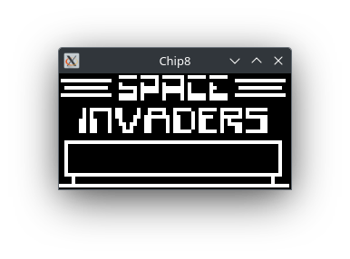

Chip8 Emulator
--------------



## Setup

- https://www.haskell.org/ghcup/
- `sudo apt install freeglut3-dev`

## Use

```bash
cabal run exes -- <ROM-PATH>
```

## Test

```bash
cabal test
```

## Reference

- https://en.wikipedia.org/wiki/CHIP-8
- http://devernay.free.fr/hacks/chip8/C8TECH10.HTM
